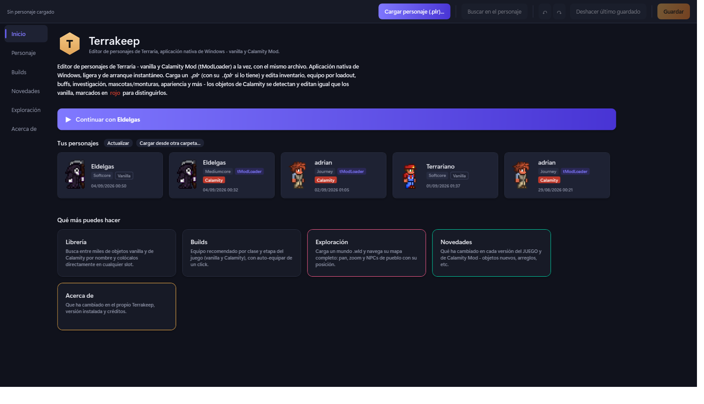
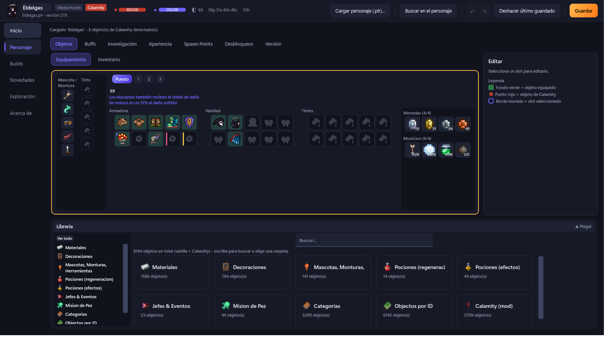
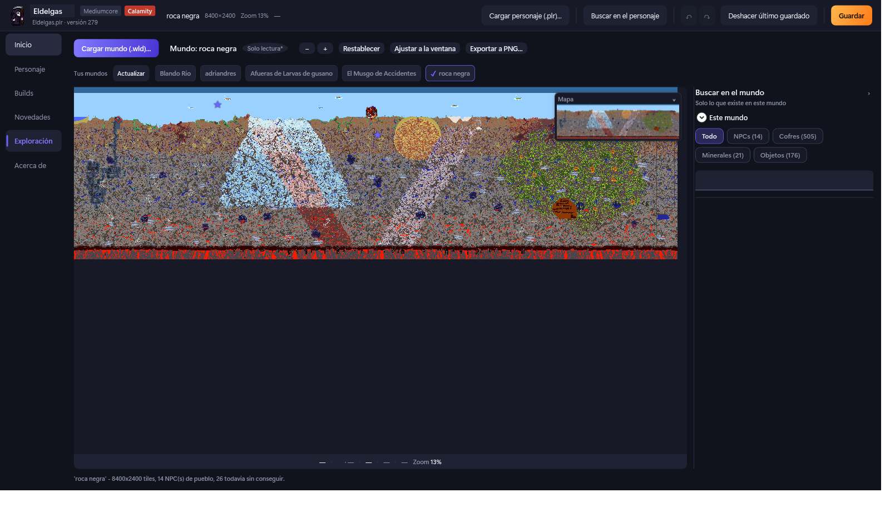
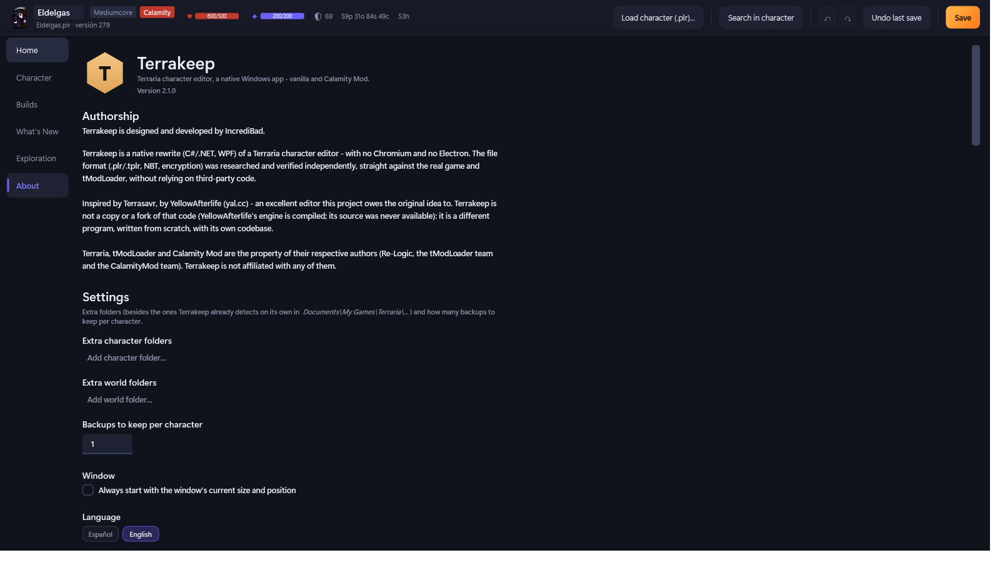

# Terrakeep

Editor de personajes y mundos de **Terraria** - vanilla y **Calamity Mod** (tModLoader) a la
vez, con el mismo archivo. Aplicación nativa de Windows (C#/.NET, WPF): sin Chromium, sin
Electron, ligera y de arranque instantáneo.



## Qué hace

- Carga un `.plr` (con su `.tplr` si lo tiene) y edita inventario, equipo por loadout, buffs,
  investigación, mascotas/monturas, apariencia y más. Los objetos de Calamity se detectan y
  editan igual que los vanilla, marcados en rojo para distinguirlos.
- **Librería** con más de 8000 objetos (vanilla + Calamity) organizados por categoría, buscador
  por nombre y colocación directa en cualquier slot.
- **Builds**: equipo recomendado por clase y etapa del juego (vanilla y Calamity).
- **Exploración de mundos**: carga un `.wld` y navega su mapa completo con pan/zoom, busca
  minerales/tiles/paredes/líquidos, marca resultados en el mapa, revisa cofres y puntos de
  reaparición, y edita la dificultad del mundo (Clásico/Experto/Maestro/Viaje).
- **Español e inglés en vivo**, sin reiniciar la aplicación.
- Deshacer/rehacer, copia de seguridad automática antes de cada guardado, y ninguna escritura
  sin confirmación explícita.







## Descarga

Ver la sección [Releases](../../releases) de este repositorio. Dos formas de conseguirlo,
mismo `.exe` por dentro:

- **Instalador** (`TerrakeepSetup-<versión>.exe`) - de doble clic, crea accesos directos en el
  menú Inicio y un desinstalador real en "Aplicaciones y características" de Windows.
- **Portable** (`Terrakeep-<versión>-portable.zip`) - descomprime y ejecuta `Terrakeep.exe`
  directamente, sin instalar nada.

Ambos son autocontenidos: no hace falta tener instalado ningún runtime de .NET aparte.

## Compilar desde el código fuente

Requiere el SDK de **.NET 10** y Windows (usa WPF).

```
dotnet build
dotnet test
```

Para generar tú mismo el instalador o el `.zip` portable, ver los comentarios de
`installer/TerrakeepSetup.iss` e `installer/install.ps1`.

## Autoría y créditos

Terrakeep está diseñado y desarrollado por **IncrediBad**.

Es una reescritura nativa desde cero: el formato de archivo (`.plr`/`.tplr`, NBT, cifrado) se
investigó y verificó de forma independiente, directamente contra el juego real y tModLoader. El
lector de mundos (`.wld`) y la paleta de colores del mapa se contrastaron además contra
[TEdit](https://github.com/TEdit/Terraria-Map-Editor) (MIT), un editor de mundos de Terraria muy
establecido, usado aquí solo como referencia de formato - ningún código de TEdit se ha copiado.

Inspirado en [Terrasavr](https://yal.cc/r/terrasavr/), de YellowAfterlife - un editor excelente
al que este proyecto debe la idea original. Terrakeep no es una copia ni un fork de ese código
(el motor de YellowAfterlife está compilado, nunca se tuvo acceso a su fuente): es un programa
distinto, escrito desde cero, con su propia base de código.

Terraria, tModLoader y Calamity Mod son propiedad de sus respectivos autores (Re-Logic, el
equipo de tModLoader y el equipo de CalamityMod). Terrakeep no está afiliado con ninguno de
ellos.

## Licencia

El código propio de este repositorio se distribuye bajo licencia **MIT** - ver
[`LICENSE.md`](LICENSE.md), que también acota qué queda explícitamente fuera de esa licencia
(sprites y datos de Terraria/Calamity Mod, propiedad de sus respectivos autores).
